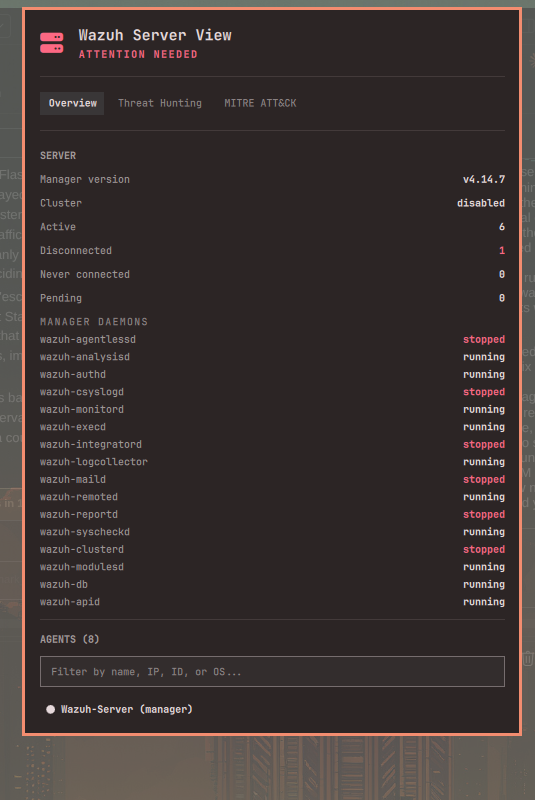
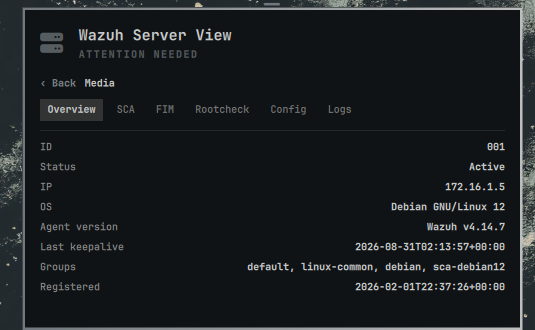
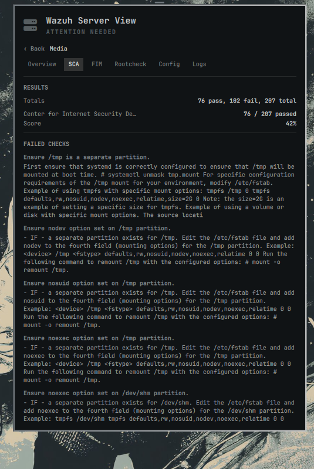
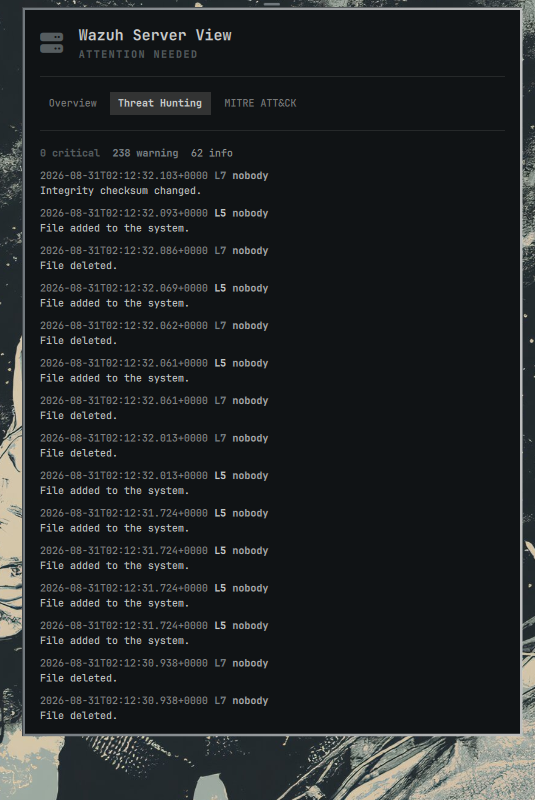
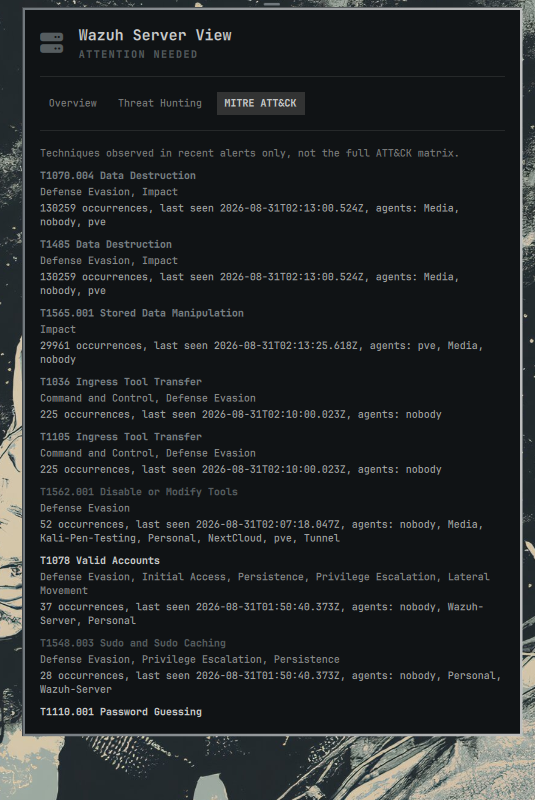

# Wazuh Server View

Every agent on a Wazuh manager, a brief server overview, per-agent drill-down
(SCA, FIM, rootcheck, effective config, recent alerts), threat hunting, and
breached MITRE ATT&CK techniques, all inside the [Omarchy](https://omarchy.org/)
Quickshell bar, no separate GUI window and no need to open the Wazuh dashboard.



This is the server-side counterpart to
[Wazuh View](https://github.com/DevInBlack001/omarchy-wazuh-view), which shows
a single local agent's own state. This plugin instead shows what a security
engineer would otherwise have to open the Wazuh dashboard to see: every agent
reporting to a manager, from one panel.

## How it works

This plugin does **not** need to run on the Wazuh manager. It talks to:

- The **Wazuh manager REST API** (default port `55000`) for the agent roster,
  server/cluster health, SCA, FIM, rootcheck, and each agent's effective
  configuration.
- The **Wazuh indexer** (OpenSearch, default port `9200`) for recent alerts,
  which back both the threat hunting feed and the MITRE ATT&CK view. The
  manager API itself does not serve alert search, so this is a second,
  independent connection.

Both are queried directly, read-only. Nothing is written to either system,
and no data leaves your machine other than the requests needed to read this
information.

## Features

- **Overview**: manager version, cluster status, manager daemon status, agent
  counts by connection state, and a searchable roster of every agent
  (name, IP, OS, version, group, last keepalive)
- **Agent drill-down** (click any agent): connection status, SCA policy
  results with failed checks and remediation text, FIM monitored-path count
  and sample, rootcheck findings, effective FIM/log-collection/active-response
  configuration, and that agent's recent alerts

  
  

- **Threat hunting**: a simple, chronological feed of recent alerts across
  every agent, with level and MITRE tags, and a critical/warning/info count

  

- **MITRE ATT&CK (breached only)**: not the full framework, only techniques
  that actually appear in alerts from the last 7 days, with occurrence count,
  last-seen time, and which agents triggered them

  

## Requirements

- Omarchy with Quickshell
- Python 3
- A reachable Wazuh manager API and (for threat hunting/MITRE) Wazuh indexer
- API/indexer credentials with read access

## Setup

Credentials and URLs are never hardcoded and never bundled with this plugin.
They come from environment variables, checked first, with an optional
credentials file as a fallback:

```bash
export WAZUH_API_URL="https://your-manager:55000"
export WAZUH_API_USER="your-api-user"
export WAZUH_API_PASSWORD="your-api-password"

# Needed for Threat Hunting and MITRE ATT&CK only:
export WAZUH_INDEXER_URL="https://your-manager:9200"
export WAZUH_INDEXER_USER="your-indexer-user"
export WAZUH_INDEXER_PASSWORD="your-indexer-password"
```

Optional, per subsystem:

- `WAZUH_API_VERIFY_TLS` / `WAZUH_INDEXER_VERIFY_TLS` (`true` by default;
  set to `false` only if you understand the risk of a self-signed cert
  you can't otherwise verify)
- `WAZUH_API_CA_BUNDLE` / `WAZUH_INDEXER_CA_BUNDLE` (path to a CA bundle,
  the better option for a self-signed deployment instead of disabling
  verification)

If you'd rather not put credentials in your shell environment, point
`WAZUH_SERVER_VIEW_CREDENTIALS` at a JSON file instead:

```json
{
  "apiUrl": "https://your-manager:55000",
  "apiUser": "your-api-user",
  "apiPassword": "your-api-password",
  "apiVerifyTls": true,
  "indexerUrl": "https://your-manager:9200",
  "indexerUser": "your-indexer-user",
  "indexerPassword": "your-indexer-password",
  "indexerVerifyTls": true
}
```

This file is only ever read from the path you name in
`WAZUH_SERVER_VIEW_CREDENTIALS` (never a guessed default location), and it
must be owned by you and mode `600`:

```bash
chmod 600 /path/to/your/credentials.json
```

Anything less strict is refused outright, the same way an SSH private key
would be, rather than silently trusted. Both API and indexer URLs must be
`https://`; a plaintext `http://` URL is refused before any credential is
ever sent.

Environment variables are visible to any process you run and, depending on
your system's configuration, potentially to other users via `/proc`. If
that matters on your machine, prefer the credentials file over exporting
passwords in your shell profile.

The manager API user needs read access to agents, syscheck, sca, rootcheck,
and agent configuration. The indexer user needs read access to the
`wazuh-alerts-*` index pattern. Neither needs write access to anything.

## Installation

```bash
omarchy plugin add https://github.com/DevInBlack001/Omarchy-Wazuh-Server-View --enable
```

Or manually:

```bash
git clone https://github.com/DevInBlack001/Omarchy-Wazuh-Server-View ~/.config/omarchy/plugins/devinblack001.wazuh-server-view
omarchy plugin enable devinblack001.wazuh-server-view right
```

Then reload the shell:

```bash
omarchy restart shell
```

## Updating

```bash
omarchy plugin update devinblack001.wazuh-server-view
```

## Removing

```bash
omarchy plugin remove devinblack001.wazuh-server-view
```

## Usage

Click the server icon in the bar to open the panel. Use the Overview /
Threat Hunting / MITRE ATT&CK tabs to switch views. Click any agent in the
Overview roster to drill into its SCA/FIM/Rootcheck/Config/Logs detail; use
Back to return to the roster. The overview refreshes every 10 seconds while
open (30 seconds in the background); an open agent detail view refreshes
every 15 seconds. This is network-bound, not a local file read, so it polls
more conservatively than a purely local plugin would.

## What this plugin never does

- Never hardcodes a manager URL, port, or credential
- Never sends credentials over a plaintext connection (HTTPS is required)
- Never disables TLS verification unless you explicitly opt in
- Never writes to the manager API or the indexer; every call is a read
- Never runs a shell command or invokes a local subprocess at all

## Scope

The MITRE ATT&CK view is intentionally not the full ATT&CK matrix: it shows
only techniques observed in alerts from the last 7 days, aggregated
server-side by the indexer, so it stays a short, actionable list rather
than a static reference you'd look up elsewhere.

## Version differences

The Wazuh REST API's shape (field names, per-component configuration
response structure) is not fully consistent across manager versions;
rootcheck in particular was deprecated in some Wazuh releases. Every
section degrades independently: a missing endpoint or a schema mismatch in
one section is reported there, without blocking the rest of the panel.

## License

MIT, see [LICENSE](LICENSE).
